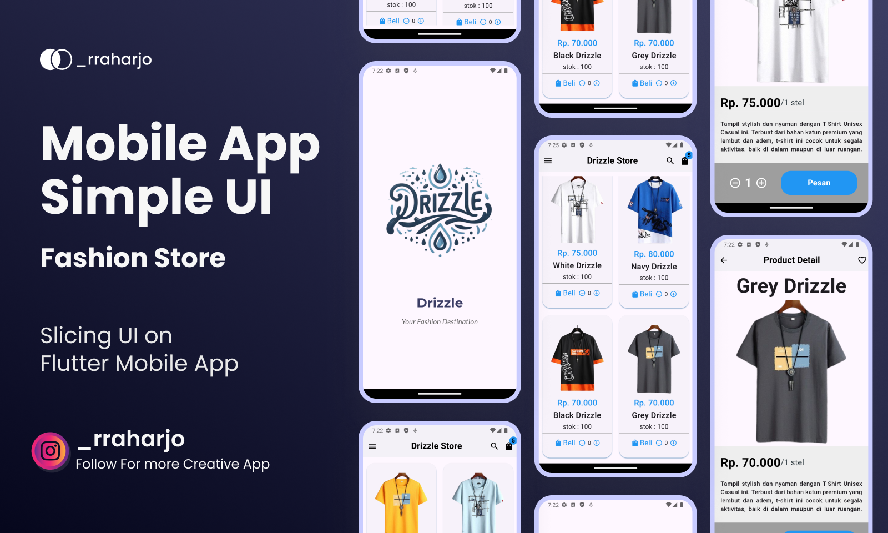

# Distro Store App - Flutter UI Slicing

This repository contains a Flutter-based UI slicing project for a Distro Store App. The project focuses on implementing a visually appealing and responsive user interface for a fictional online store that sells apparel and merchandise typical of a "distro" (distribution store) environment.

## Features

- **Modern UI Design:** Clean, minimalistic, and user-friendly design that reflects the aesthetic of a trendy distro store.
- **Responsive Layout:** UI components designed to be responsive across various screen sizes, providing an optimal experience on both mobile and tablet devices.
- **Custom Widgets:** Modular and reusable widgets that can be easily integrated and modified to fit various use cases.
- **Navigation:** Smooth navigation between different screens, including the home page, product details, cart, and user profile.
- **Theming:** Consistent color scheme and typography to maintain a cohesive look throughout the app.

## Screens Included

1. **Home Screen:** Featuring promotional banners, product categories, and a list of featured products.
2. **Product Detail Screen:** Displaying detailed information about individual products, including images, descriptions, and pricing.
3. **Shopping Cart:** A screen where users can view and manage their selected items before proceeding to checkout.
4. **User Profile:** A screen for users to view and edit their personal information.

## How to Run

1. Clone this repository: git clone https://github.com/kun-genos/distro-store-app.git
2. Ensure Flutter is installed and set up on your machine.
3. Navigate to the project directory and install dependencies:

- cd distro-store-app
- flutter pub get

4. Run the application: flutter run

## Contributing

Contributions are welcome! Please feel free to submit a Pull Request.

## License

This project is licensed under the [MIT License](LICENSE).
